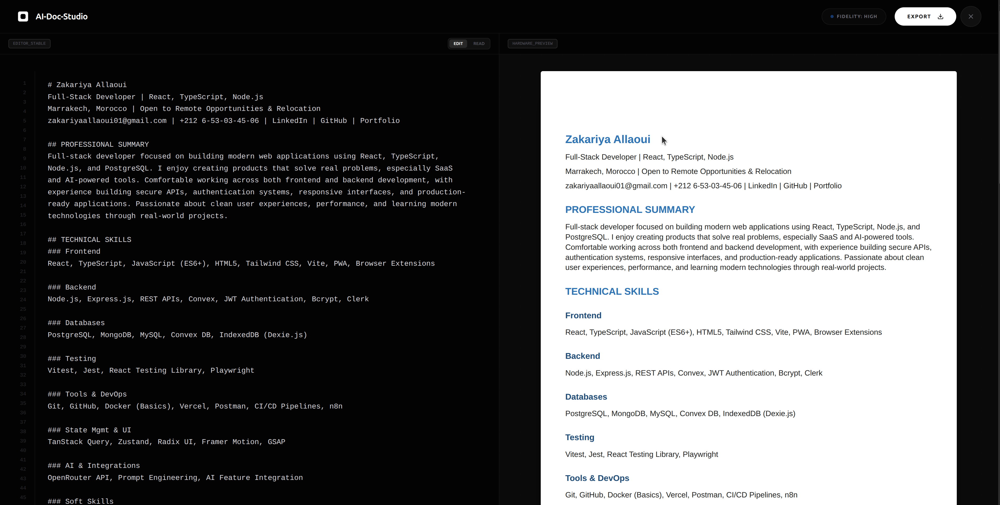

<div align="center">
  

# AI Doc Studio

<p align="center">
  <strong>Security-first PDF-to-Markdown reconstruction studio</strong>
</p>

<!-- Badges -->
<p align="center">
  
  
  
  
</p>

<p align="center">
  
  
  
</p>


</div>

---

# ✨ Features

<div align="center">

| 🔐 Security | 📄 Uploads | 🤖 AI Reconstruction | 📊 Limits |
|---|---|---|---|
| Invite-only authentication | Private signed uploads | OpenRouter-powered extraction | Daily usage control |

</div>

## Core Capabilities

- 🔐 **Invite-only access**
  - Supabase magic-link authentication with `shouldCreateUser: false`

- 📤 **Secure uploads**
  - Private Supabase Storage bucket
  - Signed upload URLs with expiration

- 🧠 **Smart reconstruction**
  - Server-side PDF processing
  - AI-powered markdown rebuilding using OpenRouter

- 📝 **Export support**
  - Markdown sanitization
  - TXT / MD / DOCX export formats

- ⏱️ **Automatic cleanup**
  - Daily cron jobs remove expired files
  - Optimized for Vercel Hobby deployment

---

# 🎯 Quick Start

## 1. Clone the Repository

```bash
git clone https://github.com/yourusername/ai-doc-studio.git
cd ai-doc-studio
```

## 2. Install Dependencies

```bash
npm install
```

---

## 3. Configure Environment Variables

```bash
cp .env.example .env
```

Fill in:

- Supabase credentials
- OpenRouter API key
- Deployment URL
- Cron secret

---

## 4. Start Development Server

```bash
npm run dev
```

---

# 🌐 Live Demo

👉 [AI Doc Studio Live Demo](https://ai-doc-studio.vercel.app)


---

# 🏗️ Architecture

```txt
Client (React + Vite)
        │
        ▼
API Routes (Vercel Functions)
        │
 ┌──────┴──────┐
 ▼             ▼
Supabase     OpenRouter
(Auth + DB)     AI
```

---

# 🔒 Security Model

| Layer | Protection |
|---|---|
| 🔑 Authentication | Invite-only magic links |
| 🛡️ API Routes | Bearer token validation |
| 📁 Storage | Private bucket + signed URLs |
| 🔐 Secrets | Service keys never exposed |
| ⚡ Rate Limiting | Postgres-backed daily limits |

---

# 🛠️ Tech Stack

<div align="center">

| Category | Technology | Purpose |
|---|---|---|
| 🎨 Frontend | React 19, TypeScript, Vite 6 | Modern SPA |
| 🎭 Styling | Tailwind CSS 4 | Responsive UI |
| 🔐 Authentication | Supabase Auth | Magic-link login |
| 🗄️ Database | Supabase Postgres | User data + limits |
| 📦 Storage | Supabase Storage | Private file storage |
| 🚀 Deployment | Vercel Functions + Cron | Serverless backend |

</div>

---

# 📡 API Endpoints

| Method | Route | Auth | Description |
|---|---|---|---|
| POST | `/api/uploads/create` | ✅ | Create signed upload URL |
| POST | `/api/documents/reconstruct` | ✅ | Process and rebuild document |
| POST | `/api/maintenance/cleanup` | ✅ Cron Secret | Remove expired files |
| POST | `/api/reconstruct` | ❌ Disabled | Legacy route returning `410` |

---

# 🚀 Deployment

## Prerequisites

- Supabase project
- OpenRouter API key
- Vercel account

---

## Quick Deploy

[vercel.com](https://vercel.com/button)


---

## Manual Setup

<details>
<summary>📋 Click to expand deployment steps</summary>

### Supabase Setup

```sql
-- Run schema.sql in Supabase SQL Editor
-- Enable email auth + magic links
-- Create private bucket: documents-temp
```

### Environment Variables

Copy:

```bash
.env.example
```

Then configure all required variables.

### Vercel Configuration

- Import repository
- Use Vite preset
- Add environment variables
- Deploy project
- Add deployment URL to Supabase redirect URLs

</details>

---

# ⚙️ Environment Variables

<details>
<summary>🔧 Full configuration</summary>

| Variable | Required | Scope | Purpose |
|---|---|---|---|
| `VITE_SUPABASE_URL` | ✅ | Browser | Supabase project URL |
| `VITE_SUPABASE_ANON_KEY` | ✅ | Browser | Public anon key |
| `SUPABASE_SERVICE_ROLE_KEY` | ✅ | Server | Admin operations |
| `OPENROUTER_API_KEY` | ✅ | Server | AI access |
| `APP_BASE_URL` | ✅* | Server | Production URL |
| `CRON_SECRET` | ✅ | Server | Protect cleanup route |

> `*` Required in production.

</details>

---

# 📊 Operational Limits

| Resource | Limit |
|---|---|
| 📄 PDF Size | 15 MB |
| 📑 Pages | 40 |
| 📝 Characters | 200,000 |
| 🔄 Daily Jobs | 20 per user |
| ⏰ File Retention | 24 hours |

---

# 🧪 Verification

## Automated Checks

```bash
npm run check
npm run security:audit
```

---

## Manual Testing Checklist

- ✅ Landing page loads correctly
- ✅ Magic-link modal works
- ✅ Unknown users cannot create accounts
- ✅ Unauthorized API requests return `401`
- ✅ Users can upload and reconstruct files
- ✅ Export functionality works
- ✅ Cross-user access is blocked

---

# 🤝 Contributing

Contributions are welcome.

1. Fork the repository
2. Create a feature branch
3. Commit your changes
4. Open a pull request

---


<div align="center">

### Built with ❤️ using React, Supabase, OpenRouter, and Vercel

</div>